# CPO lab3 - vegetable

## Basic Information
> - ### title:  
>   &emsp;**Laboratory work 3**
> - ### list of group members:  
>   - **Liu Fen**
>       - ID in HDU: 202320050
>       - email: 962928173@qq.com
>   - **Zhuo Lin**
>       - ID in HDU: 202320058
>       - email: lynn_zhuolin@163.com
> - ### laboratory work number:  
>   **3. Command line interface builder Many programs have a complex Command-Line Interface (CLI). For example, docker, apt-get, yam, npm, brew. In this variant, you should develop the library for building a CLI by decorators.**
>    
>   **The main idea of a library is the separation of CLI and handlers implementation, like you can see in Flask web-framework separation of web API/route and handlers implementation**
> - ### variant description:  
>   > **(a) Features of a library:**
>   >
>   > support of flags with default values (python3 --version, python3 -V, python -v)
>   >
>   > support of position arguments (python3 module.py, cat file1 file2)
>   > 
>   > support named arguments with default values (python3 -m module_name)
>   >
>   > support of sub-commands with a different set of arguments (e.g., git have subcommands git add, git status, git log)
>   >
>   > automatic help and error message generation
>   > 
>   > support type conversation for arguments value (e.g., head -n 5 conversation string “5” to int value 5)
> 
>   > **Your library should be well documented**
> 
>   > **To prove correctness, you should use unit tests**
> 
>   > **To prove usability, you should implement command-line utilities that demonstrate all library features. E.g., develop an application for storing passwords, todo, or address book**
    
## 6.26 update
>Teacher, the main changes are:
> 
> 1. Replace global variables with class variables
>
> 2.'"CLI.py" is the logical implementation part of CLI, "unit_test.py" is the CLI function test, "CLI_decorator.py" is the CLI decorator, "test_example.py" is the example of using CLI decoration
>
> 3. The format of each running command is written in'"CLI.py", all of which are automated
> 

## 6.27 update
> Teacher, the main changes are:

> 1. Output version information
> 
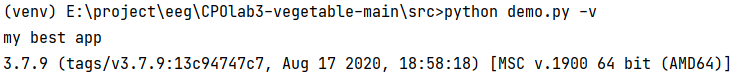

> 2.Output the path of the specified file
> 
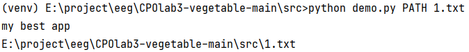

> 3. Read the contents in the file
> 
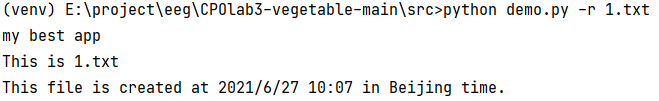

> 4. add data to the file
> 
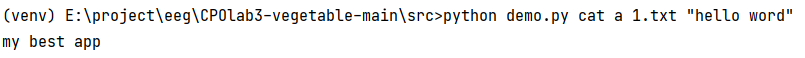

> 
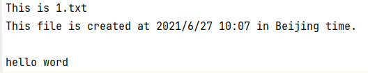

> 5.create a new file
> 
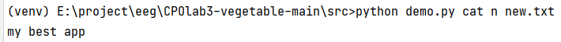

> 
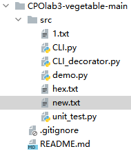

> 6. Delete a file
> 
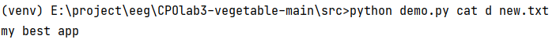

> 
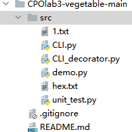

> 7. Output help information
> 
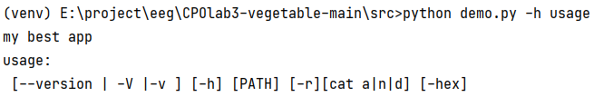

> 
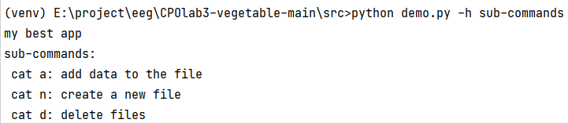

> 
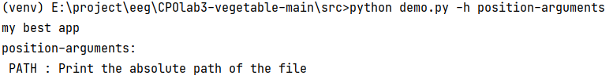

> 
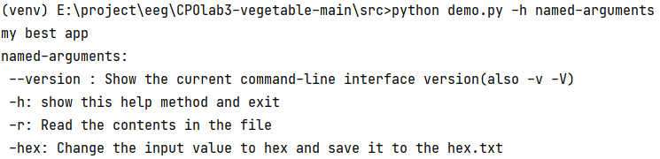

> 8.Change the input value to hex and save it to the hex.txt
> 
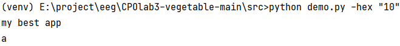

> 
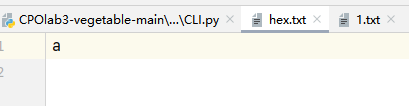

> 9. Pass a simple variable value
> 
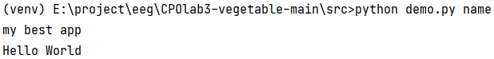

> 
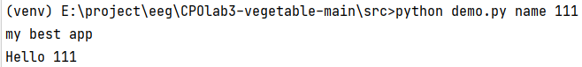

> 
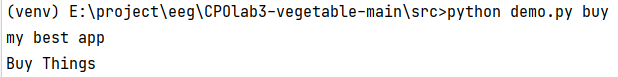

> 
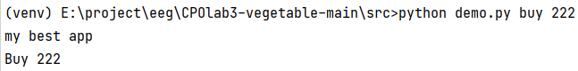

